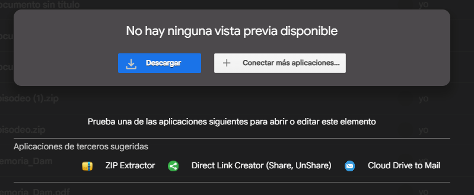

# Guía de Configuración — Episodeo

Esta guía cubre dos escenarios:
- **[Instalar el APK](#instalación-del-apk-usuario-final)** en un dispositivo Android (usuario final).
- **[Configurar el entorno de desarrollo](#entorno-de-desarrollo)** para compilar el proyecto desde el código fuente.

---

## Instalación del APK (Usuario Final)

### Requisitos del Sistema

| Requisito | Mínimo |
|-----------|--------|
| Sistema Operativo | Android 8.0 (Oreo) |
| Espacio libre | 50 MB |
| Conexión | Internet (primer inicio de sesión) |

### Paso 1 — Descargar el APK

El archivo `episodeo_release.apk` está alojado en Google Drive. Necesitarás el enlace proporcionado por el desarrollador.

1. Abre el enlace de **Google Drive** en tu móvil.
2. Pulsa el botón de **Descargar** ⬇.
3. Si aparece el aviso *"El archivo puede ser dañino"*, pulsa **Descargar de todos modos** — esto es esperado en apps académicas no publicadas en Play Store.



*Aviso de descarga en Chrome/Google Drive.*

### Paso 2 — Ejecutar el Instalador

1. Una vez descargado, pulsa sobre la **notificación de descarga** o busca el archivo en tu carpeta de **Descargas**.
2. Pulsa sobre `episodeo.apk`.

### Paso 3 — Habilitar Orígenes Desconocidos

Android bloquea por defecto la instalación de apps externas. Debes autorizarla:

1. Aparecerá el aviso: *"Por seguridad, el teléfono no puede instalar aplicaciones desconocidas de esta fuente"*.
2. Pulsa **Ajustes** o **Configuración**.
3. Activa el interruptor **"Confiar en esta fuente"** o **"Autorizar descargas de esta fuente"**.
4. Vuelve atrás para continuar la instalación.

### Paso 4 — Finalizar la Instalación

1. Verás la ventana de instalación de Episodeo.
2. Pulsa **Instalar**.
3. Espera hasta ver *"Se ha instalado la aplicación"*.
4. Pulsa **Abrir**.

> **¿Google Play Protect bloquea la instalación?**
> Pulsa en **"Más detalles"** y selecciona **"Instalar de todas formas"**. Esto ocurre porque la app no ha sido verificada por Google al ser un proyecto académico.

> **Nota sobre Play Protect:** Al ser una aplicación académica no publicada en Google Play Store, tu dispositivo puede mostrar avisos de seguridad estándar. Esto es habitual en el desarrollo de software fuera del ecosistema oficial.

### Solución de Problemas de Instalación

| Error | Causa probable | Solución |
|-------|---------------|----------|
| *"Error de análisis del paquete"* | Descarga corrupta o Android < 8.0 | Borra el APK y descárgalo de nuevo. Verifica que Android ≥ 8.0. |
| *"No se pudo instalar la aplicación"* | Espacio insuficiente o versión anterior instalada | Libera espacio o desinstala la versión anterior. |

---

## Entorno de Desarrollo

Esta guía detalla paso a paso cómo preparar el entorno para compilar y ejecutar Episodeo desde el código fuente.

---

### Requisitos Previos

| Herramienta | Versión mínima |
|-------------|---------------|
| Android Studio | Hedgehog (2023.1.1) |
| JDK | 11 |
| Android SDK Build-Tools | 34.0.0 |
| `compileSdk` | 36 |
| `minSdk` | 24 (Android 7.0) |
| `targetSdk` | 34 |

---

### Paso 1 — Clonar el repositorio

```bash
git clone https://github.com/ismailhaddouche/episodeo.git
cd episodeo
```

---

### Paso 2 — Configurar Firebase

Episodeo usa Firebase para la autenticación (Google Sign-In) y para almacenar los datos del usuario (Firestore).

### 2.1 Crear el proyecto Firebase

1. Ve a [console.firebase.google.com](https://console.firebase.google.com)
2. Crea un nuevo proyecto o usa uno existente
3. Haz clic en **"Añadir app"** → selecciona Android
4. Rellena el nombre del paquete: `com.haddouche.episodeo`
5. Descarga el archivo `google-services.json`
6. Copia `google-services.json` dentro de la carpeta `app/`

### 2.2 Activar Authentication con Google

1. En Firebase Console → **Authentication** → **Métodos de inicio de sesión**
2. Activa el proveedor **Google**
3. Guarda

### 2.3 Añadir el SHA-1 de tu keystore

Para que Google Sign-In funcione en debug, Firebase necesita el SHA-1 de tu keystore:

```bash
# Desde la raíz del proyecto
./gradlew signingReport
```

Busca la línea `SHA1:` bajo `Variant: debug`. Copia ese valor.

En Firebase Console → **Configuración del proyecto** → pestaña **General** → tu app Android → **Añadir huella digital** → pega el SHA-1.

### 2.4 Crear la base de datos Firestore

1. En Firebase Console → **Firestore Database** → **Crear base de datos**
2. Selecciona **modo de producción** (o prueba para desarrollo)
3. Elige la región más cercana

**Reglas de seguridad recomendadas:**

```
rules_version = '2';
service cloud.firestore {
  match /databases/{database}/documents {
    // Cada usuario solo accede a sus propios datos
    match /usuarios/{userId}/{document=**} {
      allow read, write: if request.auth != null && request.auth.uid == userId;
    }
    // Los códigos de compartición son públicos en lectura
    match /codigos_compartir/{code} {
      allow read: if request.auth != null;
      allow write: if request.auth != null;
    }
  }
}
```

---

### Paso 3 — Configurar la API Key de TMDB

Episodeo busca series usando la API gratuita de TMDB.

1. Regístrate en [themoviedb.org](https://www.themoviedb.org/signup)
2. Ve a tu perfil → **Ajustes** → **API** → solicita una API key (uso personal/educativo)
3. Copia la **API Key (v3 auth)**
4. Abre (o crea) el archivo `local.properties` en la raíz del proyecto y añade:

```properties
sdk.dir=C\:\\Users\\tu_usuario\\AppData\\Local\\Android\\Sdk
CLAVE_API_TMDB=pega_tu_clave_aqui
```

> `local.properties` está en `.gitignore`. **Nunca lo subas al repositorio.**

La clave queda expuesta a nivel de BuildConfig en el APK compilado. Para un proyecto en producción real, debería gestionarse desde un backend propio.

---

### Paso 4 — Sincronizar y Compilar

1. Abre el proyecto en Android Studio
2. Espera a que Gradle sincronice las dependencias automáticamente
3. Si hay errores de sync: **File → Sync Project with Gradle Files**
4. Ejecuta la app: **Run → Run 'app'** sobre un emulador o dispositivo físico

---

### Problemas Comunes del Entorno de Desarrollo

### Error: `SDK Build-Tools 25.0.1` al compilar

Hay un conflicto de versiones de Build-Tools. Solución:

1. Abre **File → Settings → Appearance & Behavior → Android SDK → SDK Tools**
2. Marca **"Show Package Details"**
3. Desmarca `build-tools;25.0.1` si está instalado
4. Asegúrate de que `build-tools;34.0.0` esté instalado ✅
5. **Apply → OK**
6. **Build → Clean Project → Rebuild Project**

O desde terminal:

```bash
sdkmanager --uninstall "build-tools;25.0.1"
sdkmanager --install "build-tools;34.0.0"
./gradlew clean
```

### Error: Google Sign-In falla en runtime

- Verifica que el `google-services.json` está en `app/` (no en la raíz)
- Verifica que el SHA-1 del debug keystore está registrado en Firebase Console
- Regenera el `google-services.json` tras añadir el SHA-1

### Error: `CLAVE_API_TMDB` es null

- Asegúrate de que `local.properties` existe en la raíz del proyecto
- La clave debe estar sin comillas: `CLAVE_API_TMDB=abc123...`
- Sincroniza Gradle tras editar `local.properties`

### La caché de Gradle está corrupta

```bash
./gradlew clean --no-daemon
# En Windows: elimina %USERPROFILE%\.gradle\caches si persiste
```
