# Guía de Usuario — Episodeo

Esta guía explica cómo utilizar todas las funcionalidades de **Episodeo**, desde el primer acceso hasta las funciones sociales avanzadas.

---

## Índice

1. [Acceso y Autenticación](#1-acceso-y-autenticación)
2. [Explorar y Buscar Series](#2-explorar-y-buscar-series)
3. [Gestión de Series](#3-gestión-de-series)
4. [Listas Personalizadas](#4-listas-personalizadas)
5. [Funciones Sociales](#5-funciones-sociales)
6. [Configuración y Cuenta](#6-configuración-y-cuenta)
7. [Navegación Detallada](#7-navegación-detallada)

---

## 1. Acceso y Autenticación

Episodeo usa **Google Sign-In** como único método de autenticación. No necesitas crear ni recordar contraseñas nuevas.

**Paso único:** Al abrir la aplicación, pulsa el botón **"Conectar con Google"** y selecciona tu cuenta habitual de Gmail.

| | |
|---|---|
| 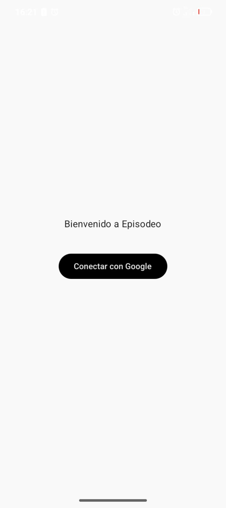 | 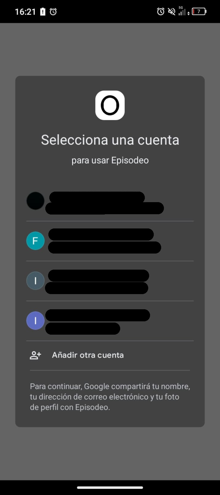 |
| *Pantalla de bienvenida* | *Selección de cuenta Google* |

> Tu sesión queda guardada y no necesitarás volver a iniciar sesión en el mismo dispositivo, salvo que cierres sesión manualmente.

---

## 2. Explorar y Buscar Series

### Buscar una serie

1. Toca el icono de la **lupa** en la barra superior o ve a la pestaña **"Inicio"**.
2. Escribe el nombre de la serie. Los resultados se actualizan en tiempo real.

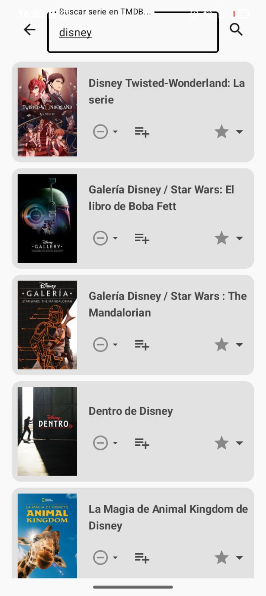

*Listado de resultados de búsqueda con pósters y títulos.*

### Ver la ficha de una serie

Pulsa sobre el **póster** de cualquier resultado para abrir su **Ficha Técnica**, que incluye:

- Sinopsis completa
- Fecha de estreno
- Reparto principal
- Plataformas de streaming donde está disponible (Netflix, HBO, Disney+, etc.)

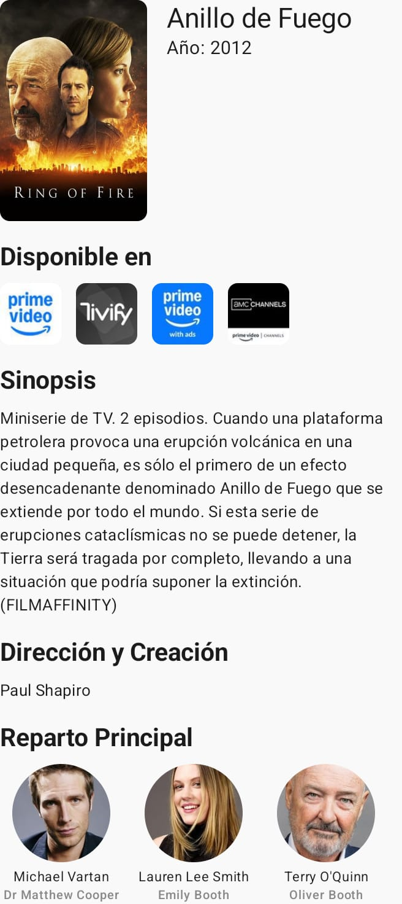

*Ficha de detalle con sinopsis, reparto y plataformas disponibles.*

---

## 3. Gestión de Series

### Cambiar el estado de seguimiento

Desde la ficha de cualquier serie, usa los iconos de estado para organizar tu progreso:

| Icono | Estado | Descripción |
|-------|--------|-------------|
| 👁️ | **Viendo** | Series que estás viendo actualmente. Aparecen primero en tu Inicio. |
| 🕐 | **Pendiente** | Tu lista de deseos para el futuro. |
| ✓ | **Terminada** | Historial de series completadas. Permite añadir puntuación. |
| ✗ | **Abandonada** | Series descartadas, filtradas para que no te molesten. |

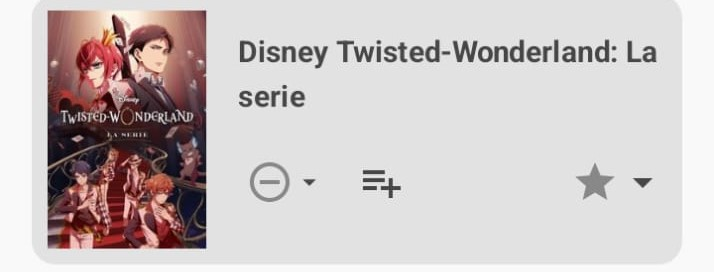

*Menú de opciones rápidas para cambiar el estado de una serie.*

### Series por estado

<table>
<tr>
<td align="center">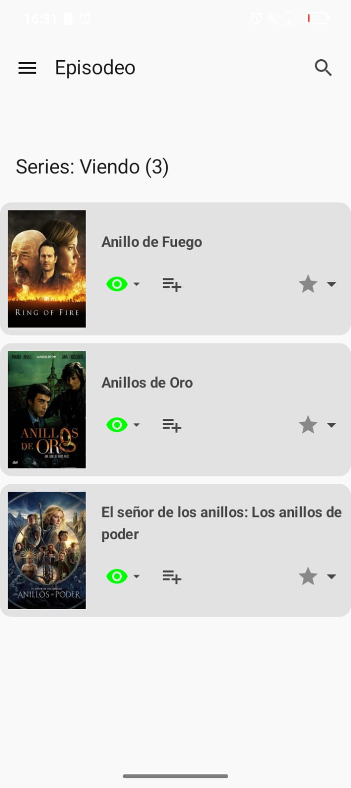<br><em>Viendo</em></td>
<td align="center">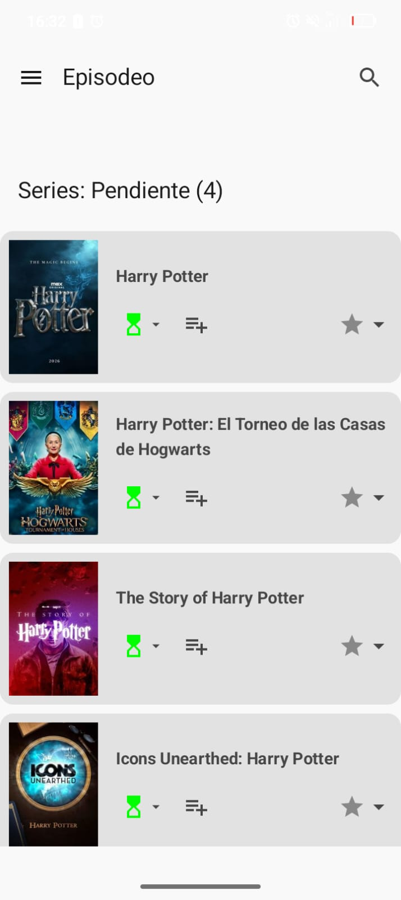<br><em>Pendiente</em></td>
<td align="center">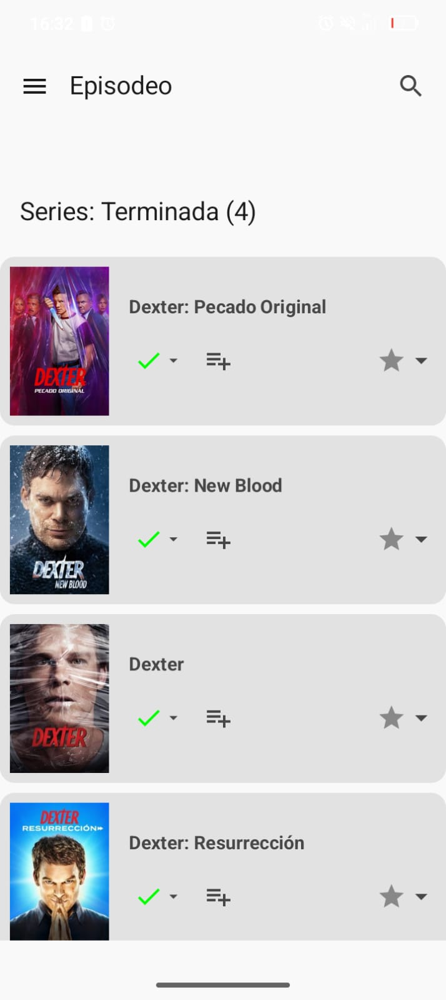<br><em>Terminada</em></td>
<td align="center">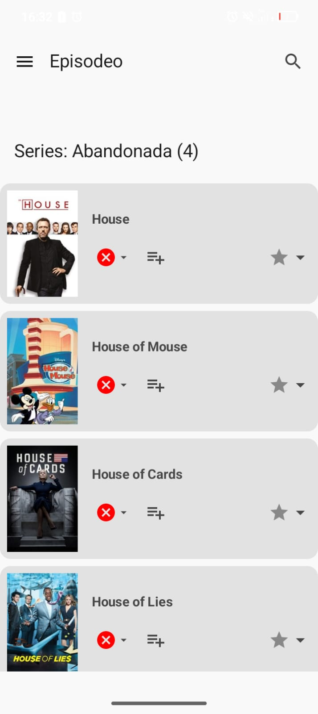<br><em>Abandonada</em></td>
</tr>
</table>

### Puntuar una serie

Una vez que una serie está en estado **Terminada**, puedes valorarla:

1. Abre la ficha de la serie.
2. Toca el icono de **estrella** ⭐.
3. Selecciona una puntuación del **1 al 10**.

La puntuación queda guardada en la nube y sincronizada en todos tus dispositivos.

---

## 4. Listas Personalizadas

Las listas te permiten agrupar series por cualquier criterio que quieras (géneros, ocasiones, recomendaciones, etc.).

### Crear una lista

1. Ve a la pestaña **"Mis Listas"**.
2. Pulsa el botón **(+)**.
3. Escribe un nombre descriptivo (ej: *"Ver con amigos"*, *"Thrillers pendientes"*).
4. Confirma para crear la lista.

### Añadir series a una lista

1. Abre la **ficha técnica** de la serie que quieres añadir.
2. Pulsa **"Añadir a lista"**.
3. Selecciona la lista de destino en el menú desplegable.

### Gestionar tus listas

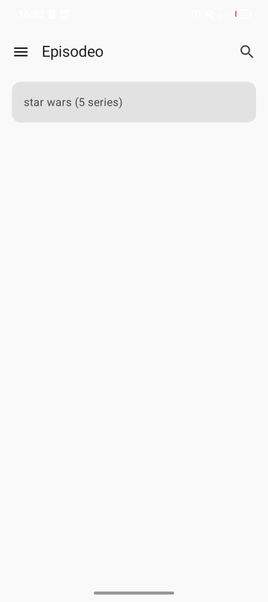

*Vista de "Mis Listas" con las colecciones creadas.*

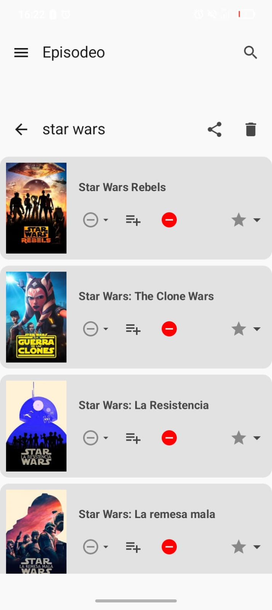

*Contenido de una lista personalizada.*

> Puedes eliminar una lista pulsando prolongadamente sobre ella y seleccionando **"Eliminar"**. Esto no elimina las series de tu seguimiento general, solo de esa lista.

---

## 5. Funciones Sociales

Episodeo incluye un sistema P2P de intercambio de listas mediante **códigos únicos**, sin necesidad de cuentas públicas ni búsqueda de usuarios.

### Compartir tu lista

1. Entra en una de tus listas en la pestaña **"Mis Listas"**.
2. Pulsa el icono de **Compartir** (flecha).
3. Se generará un **código único de 8 caracteres** (ej: `XY89ZABC`).
4. Envía ese código a tu amigo por el medio que prefieras (WhatsApp, email, etc.).

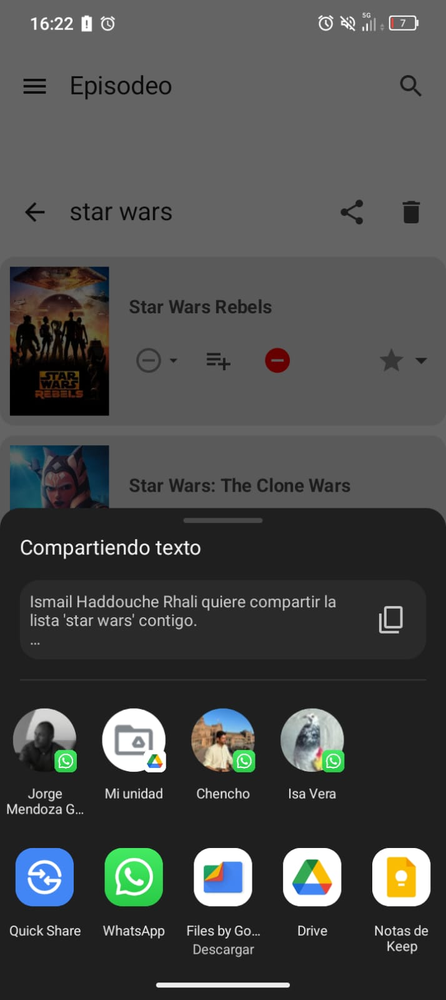

*Generación del código único para compartir una lista.*

### Seguir la lista de un amigo

1. En la pestaña **"Mis Listas"**, pulsa **"Seguir Lista"**.
2. Introduce el **código** que te ha enviado tu amigo.
3. La lista aparecerá en tu sección **"Listas Seguidas"**.

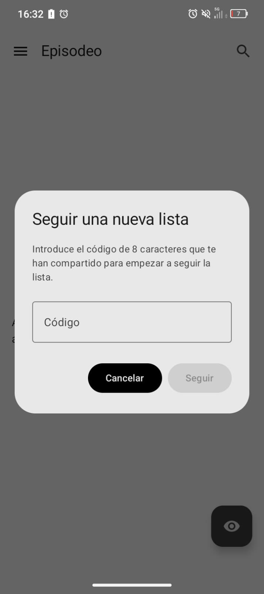

*Pantalla para introducir el código de una lista a seguir.*

### Listas Seguidas

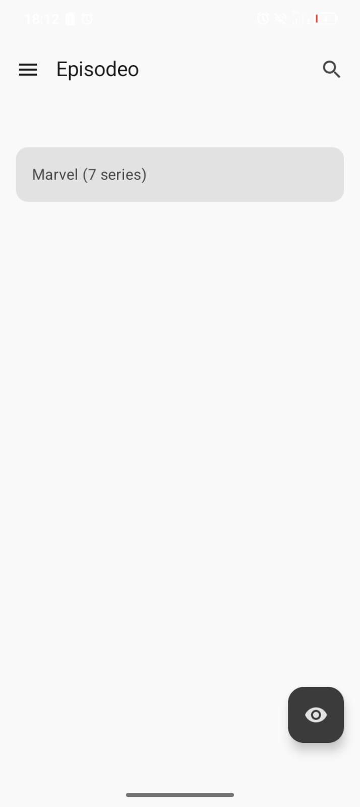

*Vista de las listas de otros usuarios que estás siguiendo.*

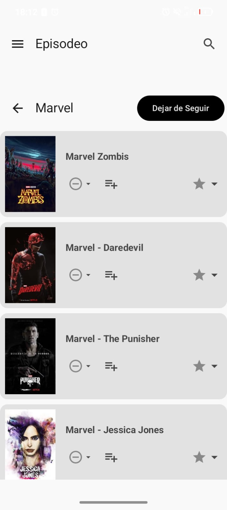

*Contenido de una lista seguida (solo lectura).*

> **Importante:** Las listas seguidas son de **solo lectura**. Puedes ver las series que tu amigo añade o elimina, pero no puedes modificar su lista. Si el creador elimina la lista, perderás el acceso automáticamente.

---

## 6. Configuración y Cuenta

Accede a la pestaña **"Ajustes"** desde la barra de navegación inferior.

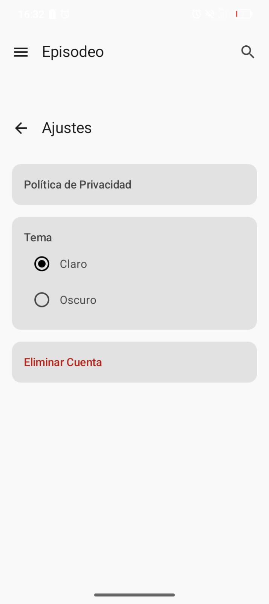

*Opciones de configuración disponibles.*

### Tema Visual

Usa el interruptor **"Modo Oscuro"** para alternar entre el tema claro y oscuro. Tu preferencia queda guardada en la nube y se aplica en todos tus dispositivos.

### Política de Privacidad

Puedes consultar la política de privacidad de la aplicación directamente desde la pantalla de ajustes.

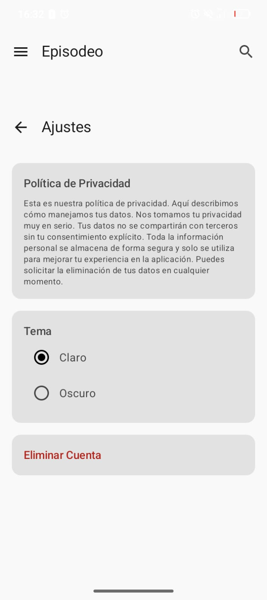

*Sección de privacidad expandida.*

### Zona de Peligro

> ⚠️ Las acciones de esta sección son irreversibles.

| Acción | Descripción |
|--------|-------------|
| **Cerrar Sesión** | Cierra tu sesión en el dispositivo actual. Tus datos permanecen en la nube. |
| **Eliminar Cuenta** | Borrado **permanente** de todos tus datos (series, listas, valoraciones) tanto en la nube como en la cuenta de autenticación. |

---

## 7. Navegación Detallada

### Estructura de la aplicación

La app se divide en **tres pestañas** accesibles desde la barra de navegación inferior:

```
┌─────────────────────────────────────────┐
│           EPISODEO                       │
│  ┌───────────────────────────────────┐  │
│  │         Pantalla Principal        │  │
│  │                                   │  │
│  │  [Carrusel: Viendo]               │  │
│  │  [Carrusel: Pendientes]           │  │
│  │  [Barra de búsqueda]              │  │
│  └───────────────────────────────────┘  │
│  ┌──────────┬──────────────┬─────────┐  │
│  │  Inicio  │  Mis Listas  │ Ajustes │  │
│  └──────────┴──────────────┴─────────┘  │
└─────────────────────────────────────────┘
```

| Pestaña | Contenido |
|---------|-----------|
| **Inicio** | Panel principal con carruseles de series por estado y barra de búsqueda. |
| **Mis Listas** | Tus colecciones personalizadas + listas de amigos seguidas. |
| **Ajustes** | Tema visual, información de la app, privacidad, cerrar sesión y eliminar cuenta. |

### Pantalla de Inicio

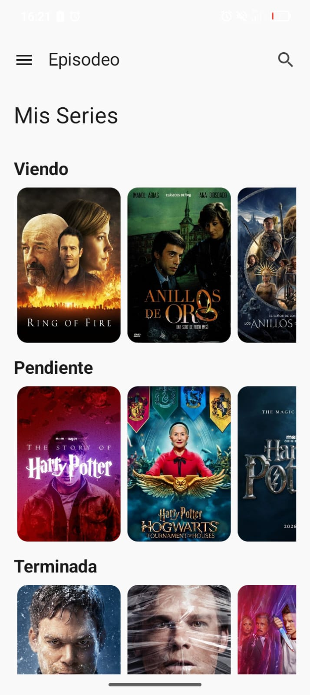

*Vista principal con carruseles organizados por estado.*

La pantalla de inicio muestra automáticamente tus series organizadas por estado. Las series en estado **Viendo** aparecen en primer lugar para facilitar el acceso rápido.

### Menú de navegación

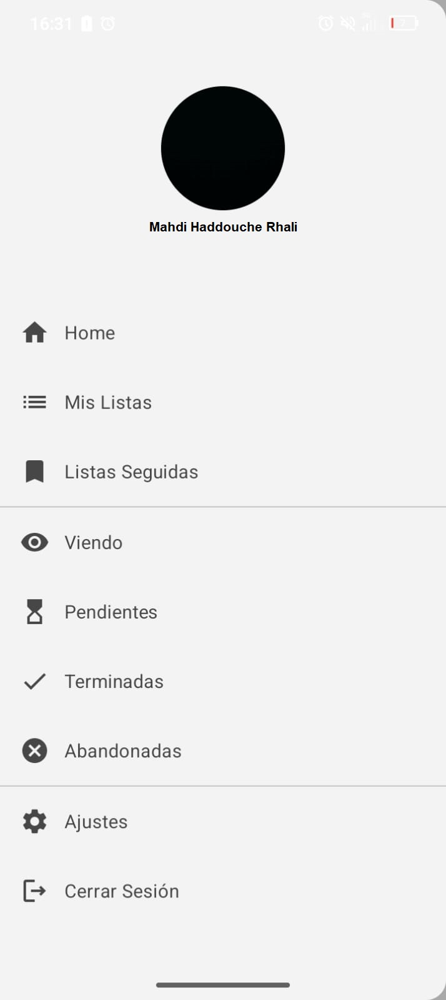

*Barra de navegación inferior con las tres secciones principales.*

---

## Flujo de uso típico

```
1. Abrir la app
       ↓
2. Buscar una serie (pestaña Inicio → lupa)
       ↓
3. Abrir la ficha técnica
       ↓
4. Marcar como "Viendo" / "Pendiente"
       ↓
5. Al terminarla → Marcar como "Terminada" + Puntuar
       ↓
6. (Opcional) Añadir a una lista personalizada
       ↓
7. (Opcional) Compartir la lista con amigos
```

---

*Para dudas sobre la instalación, consulta la [Guía de Instalación](SETUP.md).*
*Para configurar el entorno de desarrollo, consulta la [Guía de Configuración](SETUP.md).*
